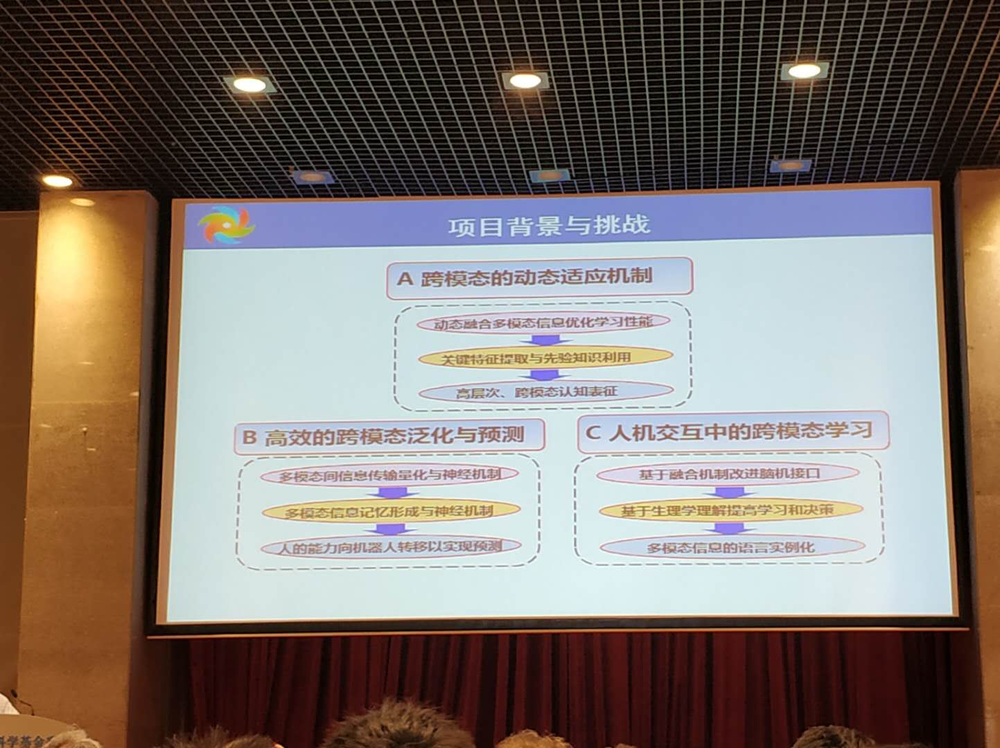

# 自然基金委中德项目多模态学习项目进展会

主要就讲一下多模态+神经科学在机器人场景连接决策中的应用项目。

## 开幕式

主要是嘉宾致辞

### 项目主要研究三个内容

总体来说这个介绍比较务虚。

### 中德项目介绍

其实中德项目还有暑期学校，如果有机会可以去了解一下。

### 一些结论

1. 当前 DL 的AI迟早要凉

2. CML（跨模态学习）可以作为研究方向（虽然说不清楚CML和DL）的具体区别。

## 项目汇报1

主要研究听觉自己的形成和机理。根本听不懂。

## 项目2，神经电路
